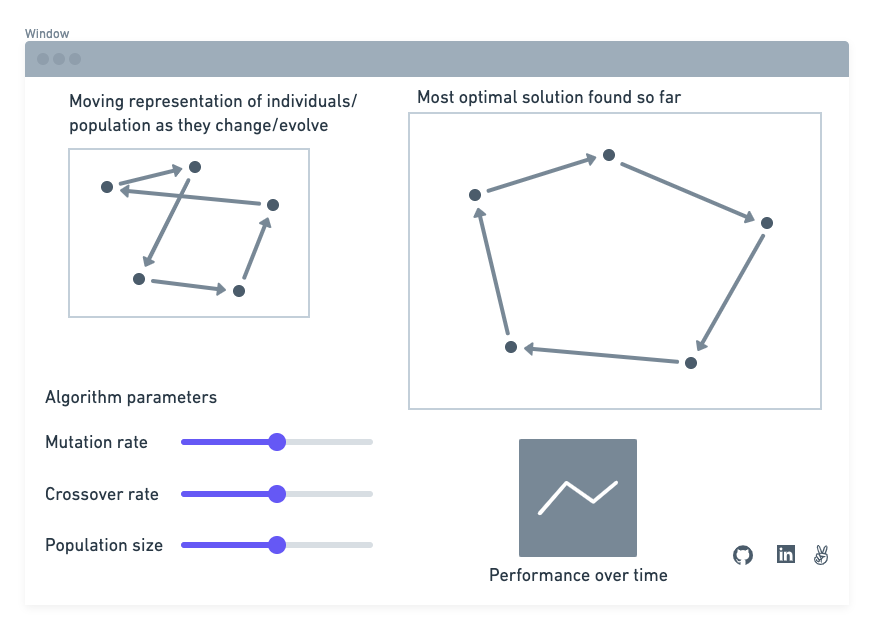

[Live link.](https://abelchiao.github.io/genetic-algorithm-visualization/)

## Background
Having come from a biotechnology background, I was inspired to pursue software by the revolutionary effect of advances in computation and data science on biological innovation.
Genetic algorithms are an embodiment of the intersection between computer science and biology, and so this project marries my past experience in genetics with my more recently acquired coding capabilities.

Genetic algorithms are optimization algorithms inspired by the principle of Darwinian natural selection.
Solutions to a problem are represented as individual chromosomes within a population and are evaluated for individual fitness/performance.
The fittest individuals in the population reproduce, producing offspring with a combination of the parents' traits; the least fit individuals are removed from the population and replaced with the children.
Further population variance/diversity is driven by random events modeled after chromosomal crossover and genetic mutation, resulting in a population that converges toward a more optimal solution with each generation. 

This project visualizes the use of a genetic algorithm to solve the traveling salesman problem - points are chosen on a map/plane and the algorithm attempts to find the shortest path that traverses every point.
Individual solutions are comprised of combinations of routes between two points on a map (genes).
The individual's fitness is defined by the combined total distance covered by its component routes.

## Functionality & MVP
### Core:
* Functional genetic algorithm
* Visual representation of "individuals" via Canvas
* Graph of fitness of population or fittest individual over generations via D3
* Ability for user to choose points on Canvas as input

### Bonus:
* User interaction with algorithm parameters (mutation/crossover rate, etc.)
* Application of algorithm to another simple problem

### Super Bonus:
* Calculate shortest routes through points in a maze by using BFS to creating component routes between single points.
* Use OpenStreetMap to calculate shortest route between points on a real map.

## Wireframe

## Architecture and Technologies
Javascript will be used to handle the logic (generating and filtering populations). 
Rendering of the points/routes between them will be done through Canvas.
D3 may be used to visualize the algorithm's convergence toward a solution.

Logic for manipulating individuals (generating, calculating fitness, mutating, etc.) will be handled by the `Individual` class in `individual.js`; population-level logic (generating, selection, etc.) will be handled by the `Population` class in `population.js`. The evolution logic loop will be constructed in `evolution.js`.

## Implementation Timeline
__Days 1-2:__ Research algorithm and write functional version applied to distance.

__Days 3-5:__ Build visual representation of routes on Canvas.

__Day 6:__ Graph the performance of fittest individual or the population as it changes from generation to generation.

__Day 7:__ User interactivity features - specify points, mutation/crossover rate.